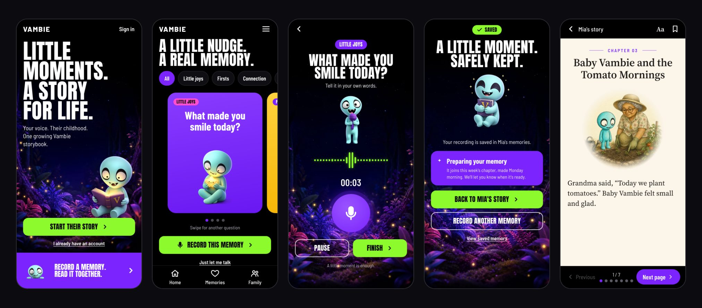

# Vambie: Storybook Generator 3000

**Little moments. A story for life.**

Vambie turns a family's voice memories into an illustrated storybook that grows with their child. Parents, grandparents and other family members record short memories on their phones. Once a week, that week's memories become a new picture-book chapter starring Baby Vambie, who stands in for the child on every page.



## What it does

- **Record a memory in a minute.** Prompt cards suggest a question ("What made you smile today?"). Each recording is transcribed, titled and understood automatically.
- **A new chapter every week.** The week's memories become one chapter, planned page by page: story moments, camera shots, picture sizes and the words under each picture.
- **One illustrated world.** Every picture is drawn in the same pen-and-ink and watercolor style. The Vambies and the family's own characters are drawn from approved reference art, so they stay recognizable from page to page.
- **Grows with the child.** Five reading stages, from "Read to me" (ages 0–3) to "Big kid" (9–12), change how long the pages are and how many pictures there are. Baby Vambie becomes just "Vambie" at age 4 by default.
- **The family writes it together.** Family members join with an invitation link. Each person's original recordings stay private to them unless they choose otherwise.
- **Reviewed before anyone reads it.** The parent approves every page before publishing. Automatic checks flag continuity, reading level and private details, and flagged chapters are held for the Vambie team in Story Review.
- **Made for reading together.** The reader shows one page per screen on a phone and a two-page spread on a tablet held sideways. Text size and paper color can be changed.

## How a chapter is made

1. **Record.** A family member records a memory and chooses who can hear it and whether it may be used in stories.
2. **Prepare.** The server transcribes the recording, gives it a title and notes what happened and how it felt.
3. **Plan.** At 6 AM on the morning after the weekly reminder, the AI plans a chapter from that week's memories at the child's reading stage.
4. **Check.** Code checks the reading limits. AI checks look for faithfulness to the memories, continuity and anything too private.
5. **Draw.** Pictures are drawn with each character's reference art attached. Each picture is checked, and redrawn once if a family member doesn't look like their approved design.
6. **Review and publish.** The parent looks through the pages, fixes anything, approves them and publishes the chapter to the family.

[How it works](docs/how-it-works.md) explains each step in detail.

## Run it locally

You need Node.js 22 or newer. You also need an OpenAI API key to write stories and draw pictures; without one, the app runs with placeholder text.

```bash
git clone https://github.com/discology/storybook-generator-3000.git
cd storybook-generator-3000
npm install
cp .env.example .env        # then add your OPENAI_API_KEY
npx prisma migrate dev      # creates the database
npm run db:seed             # adds the starter prompt cards
npm run dev
```

Open http://localhost:5174. Without Twilio settings, the sign-in code appears on screen. [Getting started](docs/getting-started.md) has the full setup, including the admin panel.

## Documentation

| Guide | What's in it |
| --- | --- |
| [Getting started](docs/getting-started.md) | Install, settings, database, running and troubleshooting |
| [How it works](docs/how-it-works.md) | From recording to published chapter, reading stages, pictures and running costs |
| [Architecture](docs/architecture.md) | Code layout, server modules, data model, background work and AI steps |
| [Privacy and access](docs/privacy-and-access.md) | Who can see and do what, what's sent to AI providers, deletion and exports |
| [Admin guide](docs/admin-guide.md) | Story Review, Prompt Library, Characters and the settings that shape every chapter |
| [Design system](docs/design-system.md) | Colors, type, components, Baby Vambie artwork and the story art direction |
| [Deployment](docs/deployment.md) | How the app is hosted on Fly.io, its settings, deploying, data and backups |

## Status

This is a working prototype, hosted on Fly.io and invite-only for now: see [Deployment](docs/deployment.md). Not built yet:

- **Sending text messages.** Sign-in codes are texted through Twilio Verify. Invites, reminders, chapter links and "your chapter is ready" alerts aren't sent yet; the app shows the message for the person to share themselves.
- **Other languages.** Stories are written in English only.

## Built with

React 18 and Vite, Express, TypeScript, Prisma with SQLite, OpenAI (GPT-5.5 for writing and checks, gpt-image-2 for pictures, gpt-4o-transcribe for speech) and Twilio Verify.

## License

No license has been chosen yet. The code is public to read, but all rights are reserved by the author.
