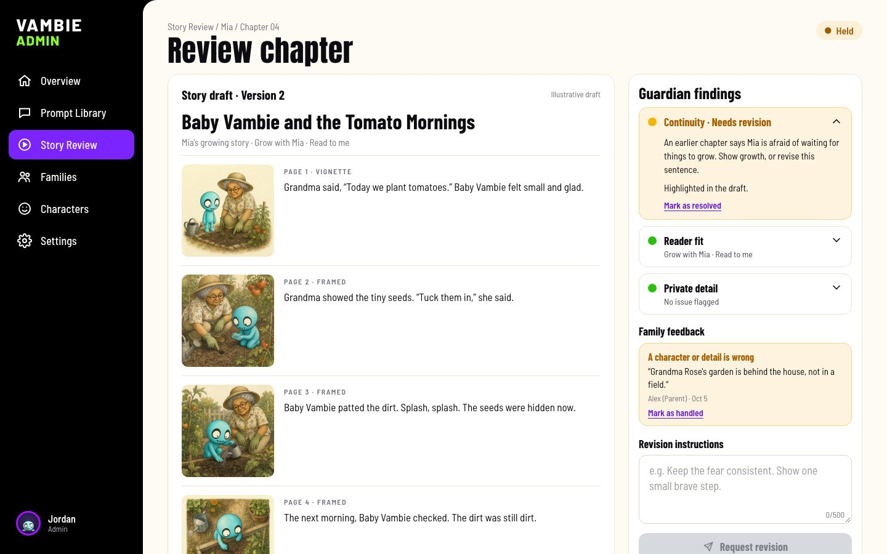

# Admin guide

The admin panel is where the Vambie team reviews chapters and shapes how every chapter is written and drawn. Open `/admin`, for example http://localhost:5174/admin. Only phone numbers listed in `ADMIN_PHONES` can open it.

## Overview

The week at a glance: chapters held for review, open family feedback, memories and chapters this week, the number of storybooks, invites waiting, and memories that couldn't be transcribed. Below that are chapters whose pictures need another try, and the latest family feedback, each linking to its chapter.

## Story Review

Every chapter passes through here.

- **Tabs.** *Needs review* lists chapters the Guardian flagged or hasn't finished reviewing, and any chapter with new family feedback. *In revision* lists chapters that were rewritten after a revision request and still have open findings. *Approved* lists the rest.
- **Search and sort** by chapter, storybook, reason or status.
- The banner confirms that **no held chapter is readable by a family**. If one ever is, it says so.

### Reviewing a chapter

- **The draft** shows every page with its picture. Passages the Guardian flagged are highlighted.
- **Guardian findings** cover continuity, reader fit, private details and removed sources. Open one to read the note. If it isn't a real problem, or it was fixed by hand, choose **Mark as resolved**.
- **Family feedback** shows what grown-ups reported from the reader. Choose **Mark as handled** once you've acted on it. Feedback doesn't block approval.
- **Request revision** rewrites the whole chapter following your instructions (up to 500 characters). It plans new pages, redraws every picture and becomes a new version. The chapter leaves the family's book until it's approved and published again.
- **Approve chapter** is available once every finding is resolved. Approving doesn't publish: the parent still approves the pages and publishes.
- **Keep on hold** takes a chapter out of the family's book until it's reviewed.
- **Run the Guardian again** reviews the chapter afresh, for example after the parent edited pages.
- **Source context** shows a short summary of each memory the chapter came from. Recordings and transcripts aren't shown.

## Prompt Library

Prompt cards are the questions families see when they record.

- **Tabs** for published, draft and archived cards, with search and a category filter.
- **Drag cards in the Published tab** to set the order families see them in. The deck preview below the table shows that order.
- The **⋯** menu publishes a card, moves it to drafts, archives it or deletes it.

### Editing a card

- **Question** (up to 90 characters) and **supporting text** (up to 120 characters).
- **Category:** pick an existing category or create a new one. Categories become the filter chips on the recording screen.
- **Audience** decides who sees the card: all contributors, parents (the Parent and Guardian relationships) or grandparents.
- **Child stage** shows the card at every age, or only while the family is expecting, for newborns (under 1) or for toddlers (1 to 3).
- **Card color** sets purple, gold, pink or green.
- **Artwork:** upload a square image, ideally 1024 × 1024. Without artwork, the card shows Baby Vambie.
- **Save draft** saves the card as a draft, which takes it out of the families' deck until you publish it. **Publish changes** updates the card for families. Memories already recorded keep the question as it was worded when they were recorded.

## Families

Every storybook: the child, who started it, how many people have joined or are invited, the reading stage, the number of memories and chapters, and when the last memory was recorded. Recordings and transcripts aren't shown here.

## Characters

The Vambie Character Library. Every chapter can include these characters, and AI instructions can refer to any of them as `<key>`.

- **Card:** name, group, look (locked and used in every picture), "never" rules, personality and voice, and role in stories. The preview shows exactly what `<key>` turns into inside AI instructions.
- **Status:** *Active* characters can appear in stories. *Draft* characters are safe to edit, and *retired* ones no longer appear.
- **When they appear:** in every chapter (like Baby Vambie), when the memory fits their casting notes, or only when a parent picks them on This week's chapter.
- **Reference art** is attached to every picture the character appears in. You can upload artwork, generate it, or **redraw it in the book's style** so the character matches the ink-and-wash pages.
- **3D renders:** the official renders, organized by camera view and expression. Select one to make it the reference art. When the reference art is a render, each page also gets the render matching its mood and camera angle.
- Editing a card or changing the reference art creates a new version. Chapters keep the version they were made with.

## Settings

### Text messages

The wording of the welcome, family invite, memory reminder and new-chapter texts. Write variables like `<child_name>` or `<record_url>` in angle brackets; the editor lists the ones each message supports and previews the result. It also counts characters, so you can see how many texts a message takes. Each message can be turned off, or reset to the default wording.

Today, only sign-in codes are actually texted. Invites and chapter links use this wording, and the app shows the message for the person to send themselves.

### AI instructions

The instructions given to the AI at each step: interpret memory, plan pages, check pages, revise a page, check a picture, describe a person, and the Guardian. See [AI steps](architecture.md#ai-steps) for when each one runs.

- Write variables in angle brackets. Each step lists its variables, and any Vambie can be included as `<key>`.
- **Model:** each step can use its own model. Checking steps often work well on a smaller, cheaper model; see [Running costs](how-it-works.md#running-costs).
- **The reply format** is shown, but it can't be edited, because the app reads the AI's reply.
- **Test run** sends the current instructions, saved or not, with sample values, and shows the reply. Each test run is a real, billed AI call.
- **Reset to default instructions** restores the built-in wording.

### Page rules

The rules every new chapter is made with.

- **Reading stages:** page counts, words per page and per sentence, vocabulary, and each stage's picture pattern.
- **Fictional embellishment:** minimal, moderate or imaginative.
- **Illustrations:** the art style, how family members are drawn, and the image model and quality.

Saving creates a new version, and only new chapters use it. The version history shows how many chapters were made with each version.
