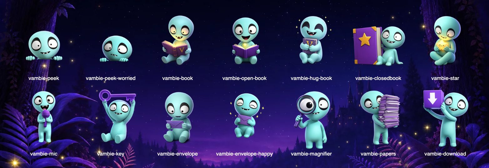

# Design system

How Vambie looks: the app, its Baby Vambie artwork, and the picture books it makes.

## The app

Black app chrome with big condensed headlines, cream panels for content, lime for the main action on each screen, and purple for selection and accents. Family screens are designed for phones first. The reader switches to a two-page spread on tablets held sideways.

### Colors

The colors are defined as CSS variables at the top of `src/index.css`.

| Token | Value | Used for |
| --- | --- | --- |
| `--black` | `#000000` | App background, top bars, tab bar |
| `--cream` | `#fefaf4` | Panels (sheets) and cards |
| `--ink` | `#0c0c10` | Text on cream |
| `--line` | `#ebe5d9` | Dividers and borders on cream |
| `--lime` | `#8cfa2c` | The main action button on each screen |
| `--purple` | `#7b24fd` | Selection, secondary buttons, links, progress |
| `--purple-soft` | `#f2e5fe` | Information notes, selected options |
| `--magenta` | `#a412fd` | The active tab in the tab bar |
| `--pink` | `#ff4fcf` | "New chapter" and category badges |
| `--amber` | `#f6b503` | Warnings and items waiting on someone |
| `--green` | `#2cbf0f` | Done and approved |
| `--red` | `#ef3a47` | Deleting and errors |

### Type

| Font | Used for |
| --- | --- |
| Anton | Headlines, in capitals: "A LITTLE MOMENT. SAFELY KEPT." |
| Barlow Condensed | Titles, buttons and badges |
| Barlow Semi Condensed | Body text and form fields |
| Barlow ExtraBold | The VAMBIE wordmark |
| Source Serif 4 | The story text in the reader |

All of these are loaded from Google Fonts in `index.html`.

### Components

The shared building blocks are in `src/components/ui.tsx`, and their styles are in `src/index.css`.

| Component | What it is |
| --- | --- |
| `Masthead` | The black header with a big headline, optional subtitle and badge, Baby Vambie art and an optional night-forest backdrop |
| `Sheet` | The cream panel under a masthead. `peek` puts Baby Vambie peeking over its top edge. |
| `Note` | A callout for information, warnings, success or plain notes |
| `StepRow` | One row of a progress list: done, in progress, waiting, held or failed |
| `MenuRow` | A row in a settings-style list, with an icon, title, subtitle and chevron |
| `Field`, `Select`, `Check`, `CheckMark`, `RadioCard`, `RadioRow`, `Switch`, `Segmented` | Form controls |
| `ProgressSteps` | The "Step 1 of 3" indicator in setup |
| `Avatar` | A person's initials or picture, or Baby Vambie for "you" |
| `BottomSheet` | A sheet that slides up from the bottom, like reading settings and memory options |
| `Mascot` | Baby Vambie artwork by name |

Buttons use the `.btn` class with a variant: `--lime` for the main action, `--purple`, `--dark`, `--outline`, `--ghost` (on black), `--danger` or `--soft`. Add `--caps` for headline-style capital lettering, and `--sm` or `--xs` for smaller sizes.

The other shared pieces are `TopBar` (back button, wordmark or title, and actions), `BottomNav` (Home, Memories, Family), `AudioPlayer` (play button with the recording's real waveform) and `PagePicture` (a page picture in its size).

## Baby Vambie artwork

The app's Baby Vambie poses are in `public/art/`. They were generated from his official 3D render, so they stay on-model, with transparent backgrounds so they sit on any screen.

| File | Pose | Where it's used |
| --- | --- | --- |
| `vambie-peek.webp` | Peeking over a ledge | On top of cream panels, avatars, the app icon |
| `vambie-peek-worried.webp` | Peeking, worried | Something needs another try |
| `vambie-book.webp` | Reading a glowing book | Landing page, sign in |
| `vambie-open-book.webp` | Holding an open book with a star | A chapter is being made |
| `vambie-hug-book.webp` | Hugging a book | Saved, account deleted |
| `vambie-closedbook.webp` | Leaning on a big book | Empty storybook |
| `vambie-star.webp` | Holding a little star | Invitations, prompt cards |
| `vambie-mic.webp` | Holding a microphone | Recording, microphone help |
| `vambie-key.webp` | Holding up a key | Checking a sign-in code |
| `vambie-envelope.webp` | Holding an envelope | Invitation problems |
| `vambie-envelope-happy.webp` | Hugging an envelope | Invitation request sent |
| `vambie-magnifier.webp` | Looking through a magnifying glass | No search results, Who's in the pictures, Help |
| `vambie-papers.webp` | Carrying a stack of papers | Preparing an export, chapter in review |
| `vambie-download.webp` | Holding a download box | Export ready |

`night-tall.webp` and `night-wide.webp` are the glowing night-forest backdrops behind headers. The poses were made with OpenAI's `gpt-image-1.5`, because `gpt-image-2` didn't support transparent backgrounds at the time. The backdrops were made with `gpt-image-2`.

## The picture books

Story pictures follow a different art direction from the app: a classic picture book, inspired by *Where the Wild Things Are* and *Frog and Toad*.

- Expressive pen-and-ink line with fine cross-hatching, finished with transparent watercolor washes. Ink first, wash second, with no 3D shading or glossy surfaces.
- A muted, earthy palette (sage, olive, ochre, warm browns, with dusky blue and violet for night and big feelings). The Vambies' own colors, like Baby Vambie's aqua, are the only bright ones.
- Warm cream paper texture. Simple faces, with feelings shown through posture and small gestures.
- Faces and the key action stay in the central 80% of the frame, so pictures can be trimmed for different screens.
- No words, letters or numbers in any picture. The story text is set below it.

Characters are drawn in this style even when their reference art is a 3D render. The art direction is edited in Admin → Settings → Page rules, and each chapter keeps the version it was drawn with.
