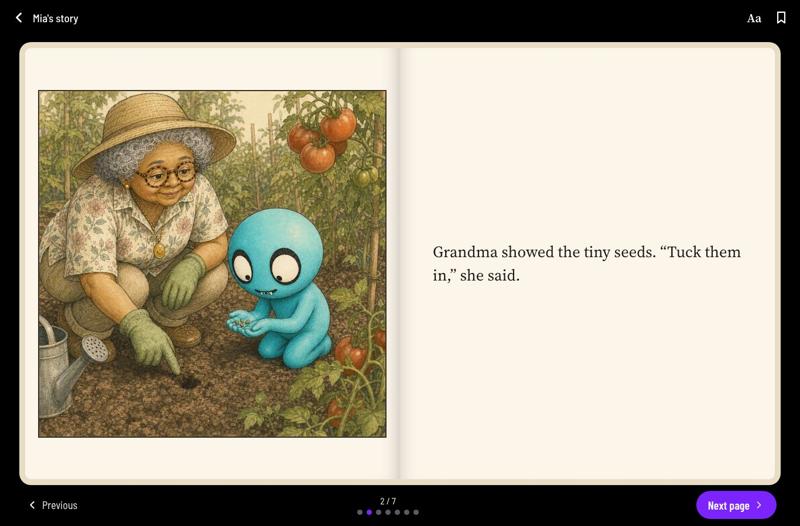

# How it works

From a voice memory to a published, illustrated chapter.

## The idea

Families record short voice memories about their child. Each week, those memories become a new chapter in the child's storybook.

The child never appears as themselves. **Baby Vambie stands in for the child on every page**, doing what the child did and feeling what they felt. That keeps the child's likeness out of AI-generated pictures and gives them a little distance to explore big feelings. Baby Vambie is called just "Vambie" from age 4 by default, and families can change that age. Family members appear as themselves, drawn from designs the parent approved.

## 0. Trying it first

New visitors see the value before they sign up. "Start their story" on the splash screen asks only for the child's name or nickname, their age (a birthday, or "on the way") and the visitor's relationship. Then the visitor records or types one memory.

- From that memory, the app writes one complete chapter and shows its first three pages as a swipeable preview. The preview opens as soon as the words are ready (about 40 seconds), and each picture fades in as it's drawn (the last one about 2 to 3 minutes in). The rest of the pages are drawn only after the visitor saves.
- Once texting is live, the wait screen also offers "Want a text when it's ready?". Verifying their number there saves the story straight away, and we text them when it's ready. Until the app can send texts, the offer is hidden.
- **Save my story and text me a link** verifies their phone number. That creates the account (or signs in to an existing one) and keeps everything they made. Weekly reminders are a separate choice afterwards, off until they turn them on.
- Until then, the draft lives only on that device, for 7 days, and then it's deleted.
- Each device and network gets one preview and one retry a day. There's also a daily cap across all visitors, set under Admin → Settings → Visitors (default 100). Past it, visitors can still record and save, and their story is made once they verify.
- A relative who opens an invitation can record first too. Their memory joins the family's storybook once they verify their number.

## 1. Recording a memory

- Anyone in the family can record, for up to 15 minutes, usually in answer to a prompt card such as "What made you smile today?". Or they can **type it** instead (up to about 4,000 characters): a typed memory skips transcription, but otherwise goes through the same steps, and shows with a pen in the memory lists. Its words can be edited later.
- When saving, they choose **who can hear the original recording**: only them, or everyone in the family. They also choose **whether the memory may be used in stories**. The storybook's privacy settings set the defaults.
- The question they answered is saved with the memory, so later edits to the prompt card don't change it.
- **Question of the week.** The first card in the deck is the family's question for the week, the same for everyone in the family. On cards meant to be answered once, the deck shows who in the family has answered ("You, Emma and Sue answered"), never what they said, and only for answers shared with the family. Once you've answered such a card, it moves to the back of your deck.

## 2. Preparing the memory

This happens on the server as soon as the recording is uploaded. Nobody presses a button.

1. **Transcribe.** OpenAI's speech-to-text turns the recording into words.
2. **Interpret.** The `interpret` AI step gives the memory a short title, and notes what happened, the feelings in it and possible themes. Anything uncertain is phrased as "may have been", never as fact.
3. **Keep or delete the audio.** If the family chose not to keep recordings, the audio file is deleted once it's transcribed, and only the words stay.

The person who recorded a memory can correct its words at any time, and the memory is interpreted again. If a step fails, the memory shows "We couldn't make out the words" with a **Try again** button.

## 3. The weekly chapter

- **When.** At 6 AM in the family's time zone, on the morning after their weekly reminder day. Sunday reminders mean a Monday-morning chapter, so memories recorded in answer to the reminder still make it in. The storybook's owner can also choose **Make it now** on This week's chapter. (A development copy only makes weekly chapters with `WEEKLY_CHAPTERS=on`.)
- **What goes in.** Every prepared memory that's allowed in stories and isn't in a chapter yet, plus any Vambies the parent picked for the next chapter.
- **A snapshot of the rules.** Each chapter stores what it was made with: the page rules version, reading stage, AI instructions, the Vambie characters and the family's approved designs. Later changes in the admin panel only affect new chapters, so a book never changes under a family.

### Planning the pages

The `page_plan` AI step plans the chapter page by page. Its voice comes from **The Vambie world**, a block of text under Admin → Settings → AI instructions: who Baby Vambie is, Parts as tiny people with intentions (from the Early reader stage up), the band as background music, and the voice for each reading stage. Facts come only from the memories; texture (light, sound, a refrain, a drum far off) is free. For each page it writes:

- the story moment, characters, setting, visible action, mood and what must carry over from neighboring pages;
- a camera shot (wide, medium, close-up and so on) with an angle and a focus;
- a picture size;
- the exact words printed under the picture;
- which memory the page draws on, and what on the page is imagined rather than reported.

It follows these rules:

- **The memories are the only source of facts.** Who was there, what happened, where, and how it ended stay exactly as told.
- **How much may be imagined** is set in Page Rules: minimal, moderate (the default) or imaginative.
- **The reading stage** sets the number of pages, words per page and sentence length (see [Reading stages](#reading-stages)).
- **Shots change** from page to page, so no two pages in a row repeat the same view.
- **The Shot list** in Page Rules says which seven shot types exist and which shots don't work on a Vambie (feet or legs as the focus, a camera below waist height). A planned shot that breaks it is replanned once before any picture is drawn.
- **People.** Family members are referred to by permanent references, never by name alone, because two people can both be called "Grandma". If the AI can't tell who someone is, or someone hasn't been designed yet, it asks the parent a question (**Who's who?**) instead of guessing. No pictures are drawn until the parent answers.

### Checking the words

- **Code** checks word and sentence limits and repeated shots on every page, and notes a shot that still breaks the Shot list after one replan.
- The **`page_check`** AI step checks that each page is faithful to the memories, consistent with its neighbors, and that the words fit the picture.
- The **Guardian** AI step reviews the whole chapter for continuity with earlier chapters, fit for the reader's stage, and private adult details. A chapter with an issue is held for the Vambie team in Story Review.

### Drawing the pictures

- **One art direction.** Every picture uses the same style: expressive pen-and-ink line with watercolor washes, on warm cream paper, where the Vambies' own colors are the only bright ones. It's set in Page Rules.
- **Camera and acting.** Page pictures follow the planned camera (close-ups crop boldly, wide shots make the characters small, angles tilt), compose off-center, catch the moment mid-movement and show the feeling on faces and bodies. It's the "Camera and acting" text in Page Rules; the planner writes each page as its peak moment and varies what each picture is about.
- **A character sheet first.** A reference sheet of the chapter's characters is drawn first. The pages are then drawn three at a time.
- **References attached to every picture,** up to five (the per-minute limit), most important first:
  1. the reference art of each Vambie on the page, or, when the Vambie has book-style expressions, the one matching the page's mood (happy, sad, scared, excited, angry, surprised, tender, laughing or sleepy);
  2. the approved portrait of each family member on the page;
  3. the chapter's character sheet (left out for close-ups, where its full-body lineup would pull the picture back to whole figures);
  4. family members' reference sheets;
  5. when a Vambie's reference art is one of its official 3D renders, the render that matches the page's mood and camera angle.
- **Pacing.** OpenAI limits how many reference images an account may send per minute. Requests wait their turn instead of failing, are retried after a rate limit, and are retried once after a timeout.
- **Learning from what went wrong.** The team flags pictures and words in Story Review; parents' feedback joins the queue ("Something's off" on a page in page review, chapter feedback from the reader, and automatic signals when they redraw a picture or ask for a change); and Admin → Feedback analyzes the flags against the Guide Book, suggests exact wording fixes, and can try a picture-rule change on the flagged pictures before anyone edits the live rules. See the admin guide.
- **Texts.** The app texts people who verified their own number: a welcome, the weekly memory reminder, a new chapter, a chapter sent to them, someone joining, a chapter ready for review, a download ready, pictures that need another try, a memory that couldn't be transcribed, and a new-link request. Invitations are texted only to numbers already verified in the app. Everything goes through one sending path that logs delivery and respects STOP (server/texts.ts); the wording is editable under Admin → Settings → Text messages.
- **Checking each picture.** The `illustration_check` AI step compares the picture with the page plan. It flags missing characters or actions, written words in the picture, anyone not drawn the way the page rules draw people (for example a person drawn as a human), and family members who don't match their approved design. A family member who doesn't match is redrawn automatically once; after that, the page is flagged for the parent.

### Review and publishing

1. **The parent reviews every page.** Answer Who's who, edit the words (the picture stays), redraw a picture, revise a page with an instruction (it rewrites the moment and redraws it), or mark "doesn't look right" for a family member. Then approve the pages.
2. **The Vambie team reviews held chapters** in Story Review. They see the draft with flagged passages highlighted and can mark findings resolved, request a full revision, approve or keep the chapter on hold.
3. **The parent publishes** once every page is approved and the chapter has passed review. It then appears for everyone it's shared with.

## Reading stages

A storybook either **grows with the child**, with the stage following their age, or stays at a stage the family picks. These are the defaults; each is editable in Page Rules.

| Stage | Ages | Pages | Words per page | Words per sentence | Pictures |
| --- | --- | --- | --- | --- | --- |
| Read to me | 0–3 | 4–6 | 15 | 8 | A big picture on every page, and one wordless page for the most meaningful moment |
| Picture book | 3–5 | 6–8 | 35 | 10 | A picture on every page: a vignette to open, framed pictures as the feeling builds, a full page for the biggest moment |
| Early reader | 5–7 | 6–8 | 50 | 12 | Mostly small vignettes and framed pictures, so the words have room |
| Chapter book | 7–9 | 6–10 | 110 | 18 | Small spot pictures on about every other page; the pages between are words only |
| Big kid | 9–12 | 4–8 | 230 | 24 | One opening picture, then full pages of words |

Changing the stage, or the age at which Baby Vambie becomes "Vambie", only affects new chapters.

## Picture sizes

| Size | Shape | Used for |
| --- | --- | --- |
| Vignette | Square, fading into the paper | Quiet openings and endings |
| Framed | Square, in a thin ink frame | As the feeling builds |
| Full | Tall, edge to edge | The biggest moments |
| Wordless | Tall, with no words on the page | The chapter's single most meaningful moment |
| None | No picture | Pages of words in the later stages |

Pages made before picture sizes existed keep their original wide format.

## Characters

- **The Vambies** live in the Character Library in the admin panel. Each has a permanent key (for example `<baby_vambie>`), a locked look, "never" rules, a personality, a role in stories, reference art and labeled 3D renders. Casting decides when they appear: in every chapter, when the memory fits their casting notes, or only when a parent picks them.
- **Family members** are added under Family → Who's in the pictures. Each has a permanent ID, the names people call them ("Grandma", "Nana"), and approved looks for different ages, such as "today" and "as a child". A look can be designed from a description or from an optional private photo. Everyone is drawn as a Vambie in their own skin tone, recognizable by their hair, glasses, clothes and accessories; pets keep their own coat with the Vambie eyes and fangs. Looks approved as people before this (VSB-86) stay until the parent presses "Redraw as a Vambie". Changing a look creates a new version, and pages that are already published keep the version they were drawn with.

## Reading and sharing

- **The reader** shows one page per screen on a phone and a two-page spread on a tablet held sideways. Readers can change the text size, choose cream, white or dark paper, and hide the controls. The screen stays on while a chapter is open. Bookmarks and reading progress are saved for each person.
- **Sharing.** Each chapter can be readable by everyone in the family, by selected family members, or only by the storybook's owner. Sending a chapter link to someone also gives them access.
- **Story feedback.** At the end of a chapter, grown-ups can say what felt off. The feedback appears in Story Review, and the chapter stays available meanwhile.

## Running costs

These are estimates from measured token usage at OpenAI's prices in October 2026, for gpt-image-2 at medium quality with GPT-5.5 for every text step.

| | 7-page chapter | 10-page chapter |
| --- | --- | --- |
| Default settings | about $1.00 | about $1.35 |
| Picture checks on `gpt-5.4-mini` | about $0.80 | about $1.05 |
| Low-quality pictures and checks on `gpt-5.4-mini` | about $0.47 | about $0.60 |

Pictures are most of the cost: about $0.05 to draw each one, plus about $0.008 for each reference image attached. Redrawing a picture costs about $0.09, and revising a page about $0.12. Designing a family member's look costs about $0.40, once. The image model and quality are set in Page Rules, and each AI step's model under AI instructions.

The real costs are recorded for every AI call. Admin → Costs shows them per chapter, per family and week by week (see the [admin guide](admin-guide.md#costs)).

## Not built yet

- Text messages other than sign-in codes: invites, reminders, chapter links and "your chapter is ready" alerts. The app shows the message for the person to send themselves.
- Stories in languages other than English.
